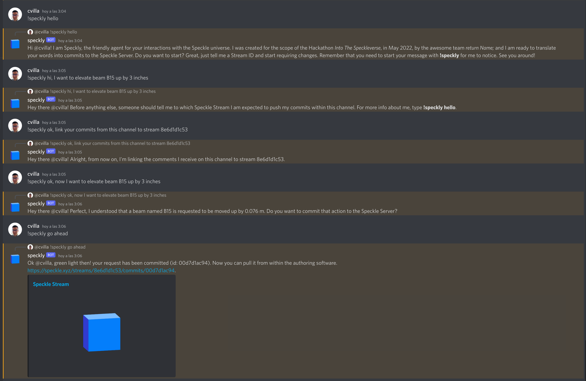
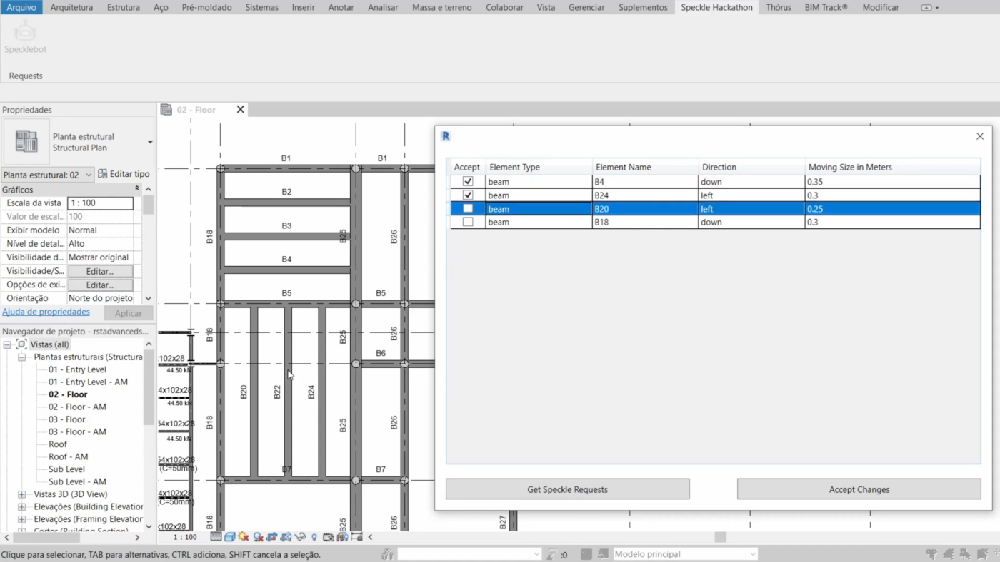

# Speckly the bot
This repository contains a hack named **Speckly the bot**, coded within the scope of the virtual hackathon
[Into The Speckleverse](https://speckle.systems/blog/into-the-speckleverse/)
by the team **return Name;**

The team is composed by four international Civil Engineers with a strong background in Software Development:
- [Rafael Anton](https://github.com/antonrafael) (Joinville, Brazil / GMT-3)
- [Chen Chih Yuan](https://github.com/ChenChihYuan) (Tokyo, Japan / GMT+9)
- [Luis Otero](https://github.com/alonsooteroseminario) (Vancouver, Canada / GMT-7)
- [Carlos Villagrasa](https://github.com/cvillagrasa) (Barcelona, Spain / GMT+2)

If you're thinking of it: yes, we tried to maximize the timezone difference in order to always have
at least one member awake and ready to code the awesome. 

## Overall hack description
Speckle and its Connectors enable previously inconceivable workflows among a variety of software 
within the AEC industry. But what if it could be even better?

Usually, engineering and architecture firms make heavy use of messaging apps such as Slack or 
Discord during their daily routine. Our hack allows any traditional user to interact with an agent 
via Natural Language, which will allow to commit directly to the Speckle Server, and ultimately 
trigger changes within the authoring software.

## Technical implementation description
Firstly, a backend for the agent is built using the Node.js [discord package](https://discord.js.org/). 
For messaging events, it checks whether the message begins with the reserved keyword *!speckly*, and then 
runs the Python script with the NLP logic by using Node's *child_process*.

The Machine Learning part is carried out in the Python script with the help of the 
[Hugging Face transformers library](https://github.com/huggingface/transformers). Successive queries are run 
against the user input in order to classify it and prepare a valid answer.

Subsequently, once a query has been successfully identified as a commit request, the Speckle Python SDK 
[specklepy](https://speckle.guide/dev/python.html) is used to effectively commit the relevant information to 
the arranged Speckle Stream.

At this point, a Revit add-in allows for listing and reviewing the commits of the relevant Stream ID coming from 
the messaging app, to then carry them out within the software, if agreed.

Since there are already some practical grasshopper components from Speckle, we can also utilize them to receive the Speckle commit change(sent from Speckly) in grasshopper via RhinoInsideRevit.
## Screenshots

