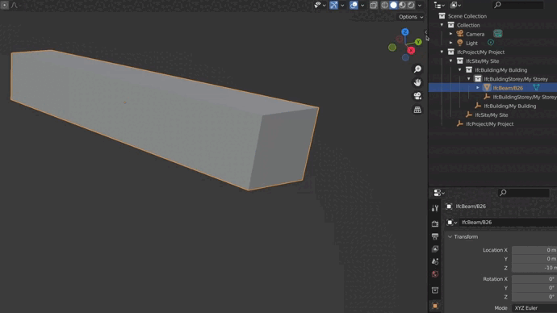

# Speckly Blender add-on

This is a Blender add-on to use the friendly bot Speckly from within Blender. It will work with IFC files thanks to 
the [BlenderBIM add-on](https://blenderbim.org/).

## About

What is Speckly? It is an NLP agent who can understand orders from within a certain chat channel, and convey them to 
the corresponding authoring software via Speckle. That way, if someone tells the agent to "move that beam down by 
20 cm", like in the example shown above, that order can eventually be accepted and automatically executed.

Speckly was developed on the [2022 Speckle Hackathon](https://hack.speckle.dev/) by us, the team *return Name;* Find out more on the 
[main page](https://github.com/antonrafael/returnName).

## Dependencies

The Speckly add-on needs these two dependencies to be installed first: 

- [Speckle Connector for Blender](https://speckle.systems/tag/blender/)
- [BlenderBIM add-on](https://blenderbim.org/)

## Installation

Follow these steps:
1. Download the [packed zip](
https://github.com/antonrafael/returnName/blob/main/src/blender_addon/releases/speckly_addon_0.0.1.zip) 
of the Speckly add-on.
2. Inside Blender, simply click *Edit* -> *Preferences*, and from the *Add-ons* tab, click *Install* and select 
the zip downloaded in the previous step.
3. Restart Blender. This is important to allow the necessary Callbacks to run.

The add-on UI can then be found under the Speckly tab from the 3D Viewport.