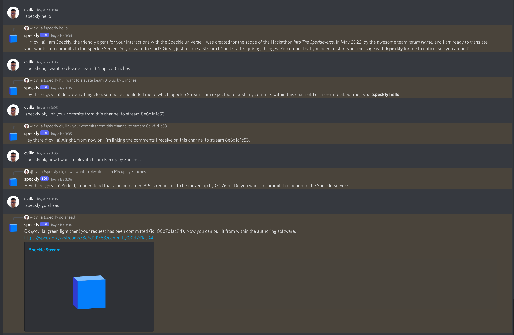

# Set-up of the Speckly, our Discord bot

1. Set the DISCORD_BOT_TOKEN enviroment variable in a .env file.

2. The server's owner needs to give access to the bot by clicking on this url:

    https://discordapp.com/oauth2/authorize?&client_id=974560257701457930&scope=bot

3. A server with Node.js in accordance with the current directory package.json needs to be up and running 
somewhere. For the days following the Hackathon, most likely someone of the team is going to keep it alive, 
in order for the bot to be tried out.

4. Chat with Speckly! Your comment needs to begin with **!speckly** 

